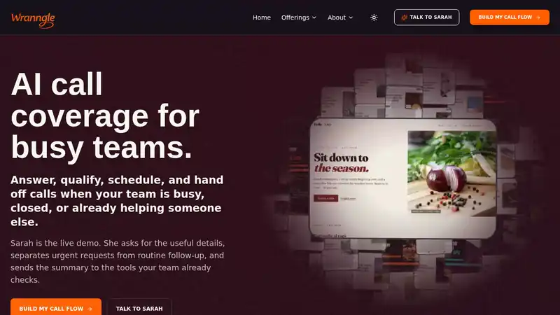
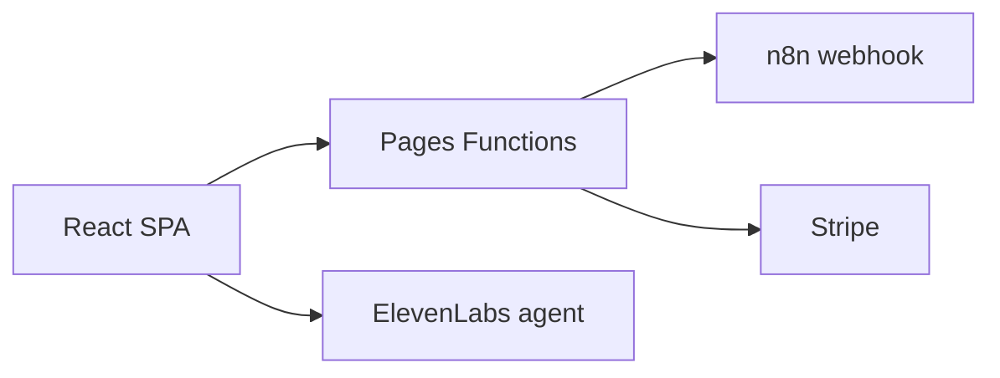

<div align="center">

#### voice agent · lead capture · stripe checkout · llms.txt · 53 demo storefronts

# Wranngle Systems

Wranngle Systems is Cody Arnold's pre-revenue operator lab for voice AI and workflow automation. This project is the official website and landing page, featuring a console-themed UI and an integrated ElevenLabs Conversational AI agent.

### [**wranngle.com**](https://wranngle.com)

**[Demo](#demo)** · **[Tech stack](#tech-stack)** · **[Getting started](#getting-started)** · **[Architecture](#architecture)** · **[Email templates](#email-templates)** · **[License](#license)**

[](https://github.com/wranngle/wranngle_com/actions/workflows/ci.yml) [](LICENSE) 

</div>

- 📞 Sarah, a live ElevenLabs ConvAI voice agent on every route
- 📥 Lead capture, ArkType-validated and forwarded to n8n
- 💳 Stripe Checkout Sessions with webhook fulfillment
- 🤖 llms.txt and llms-full.txt for AI crawlers
- 🏪 53 generated demo storefront landing pages

One repo, one Cloudflare Pages deploy, the whole storefront. 120 vitest tests.

## Demo

- **Live site:** [wranngle.com](https://wranngle.com)
- **Voice agent demo:** [wranngle.com/#talk-to-sarah](https://wranngle.com/#talk-to-sarah): Sarah is a live ElevenLabs ConvAI agent embedded on the page; mic permission required, no signup.
- **gtm_ops product page:** [wranngle.com/products/gtm-ops](https://wranngle.com/products/gtm-ops); the product page links to the gtm_ops console at [app.wranngle.com](https://app.wranngle.com).

## Tech stack

- **Runtime:** [Bun](https://bun.sh) (local dev), Cloudflare Workers (production)
- **Frontend:** React, Tailwind CSS, Framer Motion, Radix UI
- **Backend:** Cloudflare Pages Functions (serverless)
- **Validation:** ArkType
- **AI Integration:** ElevenLabs Conversational AI
- **Hosting:** Cloudflare Pages (free tier)

## Getting started

### Prerequisites

- [Bun](https://bun.sh) installed on your machine.

### Installation

```bash
bun install
```

### Development

Start the development server (Vite dev server with hot reload):

```bash
bun run dev
```

The application will be available at `http://localhost:5173`.

### Build and production

To build the project for production:

```bash
bun run build
```

To preview the production build locally with Cloudflare Pages Functions:

```bash
bun run preview
```

To deploy to Cloudflare Pages:

```bash
bun run deploy
```

For fast production updates after a local change, build locally and upload
directly to the live Cloudflare Pages project:

```bash
bun run deploy:live
```

If `dist/` is already freshly built, upload it without rebuilding:

```bash
bun run deploy:upload
```

## Project structure

- `client/`: React frontend source code.
- `functions/`: Cloudflare Pages Functions (serverless API endpoints).
- `shared/`: Shared TypeScript schemas and utilities (ArkType).
- `script/`: Build and utility scripts.
- `email-templates/`: Email template system with master inheritance.
- `content/`: Site content (pilot agreement, testimonials).
- `docs/`: Project documentation and architecture guides.

## Architecture



This is a static site with serverless API functions:

- **Frontend**: React SPA built with Vite, served globally via Cloudflare Pages CDN
- **API**: Cloudflare Pages Functions handle `/api/*` routes (e.g., `/api/leads`)
- **Lead Capture**: Lead capture is validated server-side in `functions/api/leads.ts` and forwarded to the n8n webhook; `shared/schema.ts` currently backs the welcome-email example, while `/api/events` keeps a local ArkType telemetry schema
- **Checkout**: `/api/checkout` creates Stripe Checkout Sessions with native consent collection when `STRIPE_SECRET_KEY` is configured
- **Fulfillment**: `/api/stripe-webhook` verifies Stripe Checkout events and forwards paid sessions into the n8n lead flow
- **Email System**: Transactional email templates with master inheritance, local preview generation, and template test scripts
- **Environment Variables**: Set `N8N_WEBHOOK_URL` and optional `STRIPE_SECRET_KEY` / `STRIPE_WEBHOOK_SECRET` / `SITE_URL` in Cloudflare Pages dashboard

## Email templates

This project includes an email template system. See [`email-templates/README.md`](email-templates/README.md) for full documentation.

### Quick start

```bash
# Preview all email templates
bun run email:preview:all
open email-templates/preview/index.html

# Build a specific template
bun run email:build welcome

# Run validation tests
bun run email:test
```

**Available Templates:**

- Welcome email (onboarding)
- Invoice/Receipt (billing)
- Notification (real-time alerts)
- Password reset (security)

**Key Features:**

- Local preview generation
- Template test scripts
- Mobile responsive
- Brand-consistent design
- Master template inheritance

## License

This project is licensed under the MIT License - see the [LICENSE](LICENSE) file for details.
